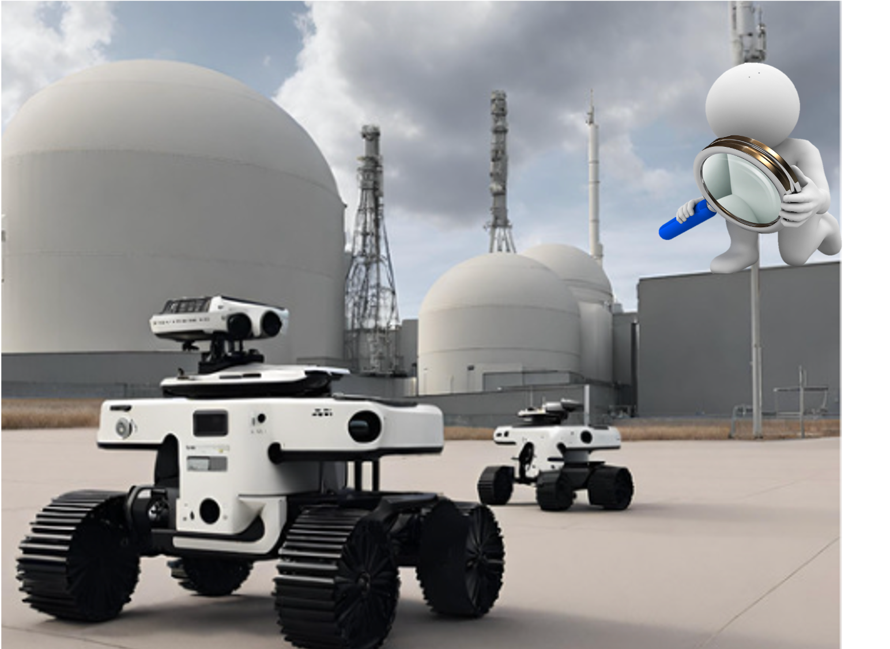
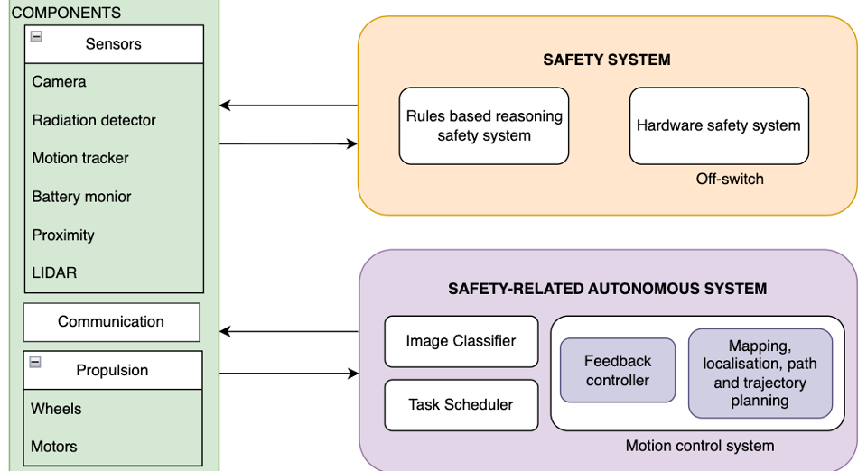

<h1 align="center" style="font-size: 64px; color: #007ACC; font-weight: 800; margin-top: 20px;">CARRLOS</h1>
<h2 align="center" style="font-size: 28px; color: #333;">Combining Autonomous Robotic Reasoning with Logical Oversight for Safety</h2>

  
  
  

---

Deploying autonomous robots in safety-critical environments demands architectures that ensure operational performance and safety. **CARRLOS** is our proposed approach to meet these dual needs with formal rigor and practical transparency.

---

## Our Mission
Create robust, certifiable autonomy systems for robots operating in environments where failure is not an option.

   

## Key Contributions

  **Integrated Control + Safety Reasoning**  
  A hybrid approach where autonomous decision-making is complemented by an independent safety reasoning layer.

  **Independent Safety & Control Modules**  
  Clear systems separation ensures modularity and fault isolation.

  **Formal Verification**  
  The safety layer is formally verified, providing **strong safety guarantees**.

  **Transparent Architecture & Trust Framework**  
  Methodologies that foster user trust through explainable decision-making and traceable behavior.

## Architecture Overview

  

